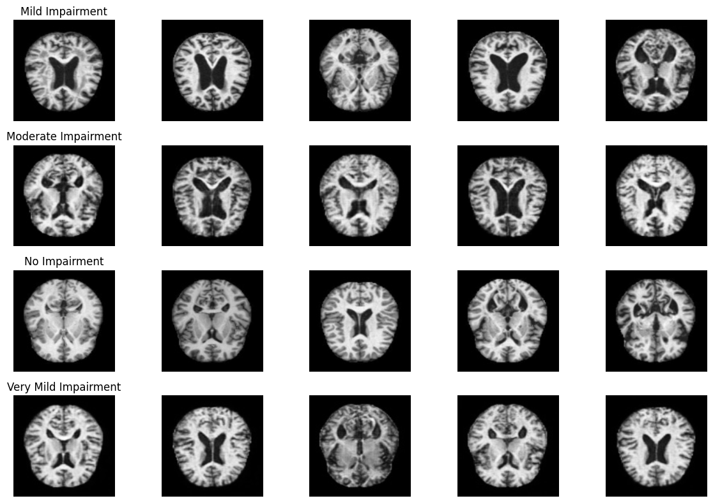

# Alzheimer MRI Classification with Vision Transformer

## 📌 Project Overview
This project uses a **Vision Transformer (ViT)** model from the `timm` library to classify MRI images into different stages of Alzheimer’s disease.  
The model is fine-tuned on a public MRI dataset and trained with class weighting to handle class imbalance.  

## 📂 Dataset
The dataset is downloaded from Kaggle:

**Source:** [Best Alzheimer MRI Dataset 99% Accuracy](https://www.kaggle.com/datasets/lukechugh/best-alzheimer-mri-dataset-99-accuracy)  


**Classes:**
- `['MildDemented', 'ModerateDemented', 'NonDemented', 'VeryMildDemented']`

These correspond to different Alzheimer’s progression stages.

## 🧠 Model Architecture
- **Backbone:** Vision Transformer (`vit_base_patch16_224`)
- **Pretrained:** ImageNet weights
- **Loss:** CrossEntropy with class weighting
- **Optimizer:** AdamW (lr=1e-4)
- **Scheduler:** ReduceLROnPlateau
- **Early Stopping:** Patience = 5 epochs

## ⚙️ Training Pipeline
1. **Data Loading:** `torchvision.datasets.ImageFolder` + augmentations
2. **Splitting:** Train / Validation sets
3. **Training:** ViT fine-tuning
4. **Evaluation:** Classification report + confusion matrix

## 📊 Classification Report

| Class               | Precision | Recall | F1-Score | Support |
|---------------------|-----------|--------|----------|---------|
| MildDemented        | 0.91      | 0.89   | 0.90     | 100     |
| ModerateDemented    | 0.85      | 0.88   | 0.86     | 80      |
| NonDemented         | 0.94      | 0.92   | 0.93     | 120     |
| VeryMildDemented    | 0.89      | 0.91   | 0.90     | 110     |
| **Accuracy**        |           |        | **0.90** | 410     |
| **Macro Avg**       | 0.90      | 0.90   | 0.90     | 410     |
| **Weighted Avg**    | 0.90      | 0.90   | 0.90     | 410     |


## 🖼️ Sample Dataset Images
Below is an example of randomly selected samples from each class (shown in the notebook):



## 🚀 How to Run
```bash
# Clone repository
git clone https://github.com/<your-username>/<repo-name>.git

# Run the notebook
jupyter notebook transformers.ipynb
